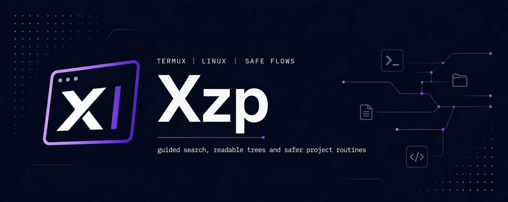

<h1 align="center">Xzp</h1>

<p align="center">
  Visual CLI para Termux y Linux con contexto de proyecto, exploracion guiada,
  arboles legibles, favoritos persistentes, auditoria y flujos mas seguros.
</p>

<p align="center">
  
  
  
</p>

## Que Es Xzp

Xzp no intenta esconder la terminal. La vuelve mas clara, mas repetible y mas segura para trabajo real en proyectos.

Sirve para:

- detectar en que stack estas
- guardar rutas frecuentes como favoritos
- buscar archivos con exclusiones persistentes
- comparar arboles y resumir estructura
- instalar dependencias con validaciones y rescate seguro
- revisar fugas y preparar reportes reproducibles

## Instalacion

Global:

```bash
npm i -g @nyxur/xzp
```

Local desde el repo:

```bash
node ./bin/xzp --help
```

## Primeros Comandos

```bash
xzp -m
xzp -x --profile
xzp -b "api client" --semantic --exclude dist --save-exclude
xzp -t . --summary --compare src
xzp --doctor
xzp -i
xzp -r
```

<p align="center">
  
</p>

## Comandos Basicos

| Area | Uso | Comandos |
| --- | --- | --- |
| Menu | navegar y ajustar la experiencia | `xzp -m` |
| Contexto | detectar stack, perfil y favoritos | `xzp -x`, `xzp -x --profile`, `xzp -x --save-favorite nombre` |
| Exploracion | buscar y comparar estructura | `xzp -b`, `xzp -t`, `xzp -t --compare` |
| Clipboard | copiar, pegar y limpiar | `xzp -c`, `xzp -p`, `xzp -k`, `xzp -K` |
| Auditoria | salud, release e inspeccion | `xzp --doctor`, `xzp --inspect`, `xzp -v` |
| Seguridad | reportes redactados | `xzp --report-error` |
| Safe mode | instalar y abrir entorno seguro | `xzp -i`, `xzp -r` |

## Flujos Rapidos

### Contexto y favoritos

Guardar favorito del proyecto actual:

```bash
xzp -x --save-favorite backend
```

Listar favoritos:

```bash
xzp -x --list-favorites
```

Eliminar favorito:

```bash
xzp -x --remove-favorite backend
```

### Busqueda y arboles

Busqueda semantica con exclusiones persistentes:

```bash
xzp -b "api client" --semantic --exclude dist --exclude coverage --save-exclude
```

Arbol con resumen:

```bash
xzp -t . --depth 3 --summary
```

Arbol comparativo:

```bash
xzp -t . --compare src --summary
```

### Agent mode

Modo pensado para AI agents o automatizaciones:

```bash
xzp --agent-on
xzp --agent-status
XZP_AGENT_MODE=1 xzp --doctor
XZP_AGENT_MODE=1 xzp -b "api client" --semantic
```

Cuando esta activo:

- prefiere JSON por defecto
- evita prompts en comandos compatibles
- usa defaults seguros para flujos no interactivos

## Recetas Por Lenguaje

### Node

```bash
xzp -x --profile
xzp -b "package" --scope actual
xzp -i
xzp -r
```

### Python

```bash
xzp -x --profile
xzp -b "requirements" --scope actual
xzp -i
xzp -r
```

### PHP

```bash
xzp -x --profile
xzp -b "composer" --scope actual
xzp -i
xzp -r
```

### Go, Rust, Java y Ruby

```bash
xzp -x --profile
xzp -t . --depth 2 --summary
xzp -i
xzp -r
```

## Install Seguro

`xzp -i` hace tres cosas antes de considerarse completo:

1. valida el proyecto y el modo de instalacion detectado
2. intenta instalacion normal o segura segun el estado guardado
3. ejecuta un post-check y persiste el resultado en config

Esto ayuda a distinguir entre:

- instalacion correcta
- instalacion terminada con alertas
- proyecto que requiere rescate seguro

## Reportes y Configuracion

Los snapshots y reportes de error:

- redactan tokens comunes
- ocultan rutas personales como `~`
- recortan texto libre y stacks muy largos
- mantienen salida JSON usable para scripts

La configuracion vive en:

```text
~/.config/xzp/config.json
```

Incluye:

- `schemaVersion`
- `favorites.paths`
- `history.recentContexts`
- `search.savedExcludes`
- `install.reports`
- `menu.visualMode`

## Troubleshooting

### `xzp -i` falla en Termux

- revisa mirrors con `termux-change-repo`
- corre `pkg update`
- confirma que el proyecto este dentro de Android storage si el rescate seguro lo requiere

### `xzp -x` no detecta proyecto

- entra al root real del proyecto
- usa `xzp -t . --depth 2`
- usa `xzp -b "package" --scope actual` o el equivalente del stack

### JSON mezclado con ruido

- usa `XZP_OUTPUT_FORMAT=json`
- evita comandos interactivos si el flujo va a scripts

### El menu se ve muy grande en terminal estrecha

- entra a `xzp -m`
- abre `Ajustes y funciones`
- cambia `Modo visual del menu` a `compact`

## Desarrollo

Tests:

```bash
npm test
```

Verificacion rapida:

```bash
node ./bin/xzp --help
node ./bin/xzp -x --profile
node ./bin/xzp -b "api client" --semantic --exclude dist
node ./bin/xzp -t . --summary
node ./bin/xzp -v
```
