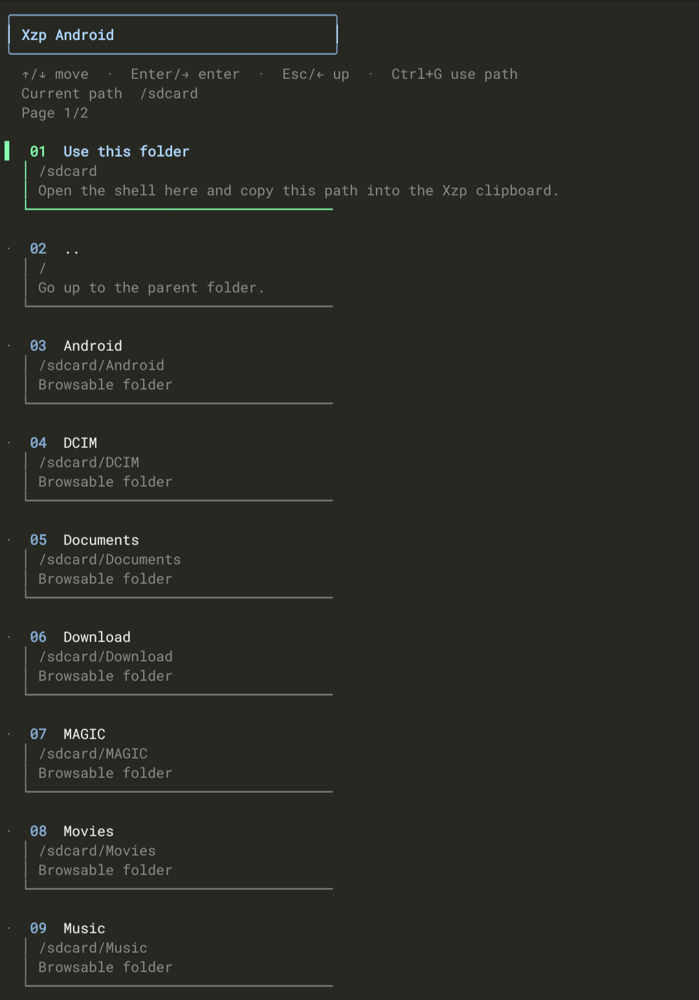

<p align="center">
  
</p>

# Xzp

**Control y visibilidad para entornos Termux y Linux.**

<p align="center">
  
  
  
  
</p>

Xzp es una herramienta técnica diseñada para optimizar la inspección de proyectos, la navegación de archivos y la gestión de contextos en la terminal. Prioriza la claridad de los datos, la seguridad en la ejecución y la compatibilidad con automatizaciones.

---

## 🛠️ Capacidades Principales

- **Detección de Contexto:** Identificación automática de rumbos de proyecto (Node, Python, PHP, Go, etc.) y estados de instalación.
- **Navegación TTY:** Explorador visual de directorios optimizado para pantallas táctiles y teclados compactos.
- **Puente de Datos (Xzp Bridge):** Sincronización transparente de archivos y rutas entre el host de Termux y distribuciones Linux (Debian, Ubuntu, etc.).
- **Smart Install:** Sistema de instalación protegida con barra de progreso visual y reportes de éxito/fallo.
- **Safe Mode:** Aislamiento de ejecución para proteger el sistema de archivos principal durante el desarrollo.

---

## 🚀 Instalación y Uso

Instalación global:
```bash
npm i -g @nyxur/xzp
```

### Comandos de Control

| Comando | Acción |
| :--- | :--- |
| `xzp -m` | Menú de acceso rápido a herramientas. |
| `xzp -a` | Navegador visual para Android storage. |
| `xzp -i` | Instalación asistida y segura del proyecto actual. |
| `xzp -c 'ruta'` | Copia inteligente al portapapeles compartido. |
| `xzp -p 'linux'` | Pegado directo en la raíz del entorno Linux configurado. |
| `xzp -r` | Apertura de shell segura con entorno aislado. |
| `xzp -t .` | Generación de árbol de directorios con resumen técnico. |

---

## 🌉 Conectividad (Cross-Environment)

Xzp permite operar entre el almacenamiento de Android y contenedores Linux sin cambiar de contexto manualmente.

- Para enviar a Linux: `xzp -p 'linux'`
- Para retornar a Termux: `xzp -p 'termux'`

*El sistema mapea automáticamente los puntos de montaje de `proot-distro` y resuelve las rutas relativas.*

---

## 🧪 Instalación Silenciosa

El sistema **Smart Install** (`-i`) reduce el ruido en la terminal capturando la salida de los gestores de paquetes y mostrando un indicador de progreso unificado. Al finalizar, genera un resumen detallado de las dependencias procesadas.

---

## 📱 Navegador Android

La interfaz visual de `xzp -a` permite una movilidad fluida entre carpetas sin ensuciar la shell con comandos `cd` repetitivos.

<p align="center">
  
</p>

---

## 🤖 Modo Agente

Xzp expone una interfaz de datos diseñada para ser consumida por agentes de IA o scripts de automatización. Activa el modo para obtener salidas JSON consistentes:

```bash
xzp --agent-on
```

---

<p align="center">
  
  <br>
  <sub>Xzp · Desarrollado para la eficiencia técnica y el control total.</sub>
</p>


